<!-- Banner -->
<p align="center">
  <a href="https://tythanai.io">
    
  </a>
</p>

<h1 align="center">TythanAI — Community Edition</h1>

<p align="center">
  <strong>An open, Web3-native security scanner.</strong><br>
  SAST · SCA · Secrets · IaC — plus first-class auditing for <strong>TON, Solidity/EVM, Solana &amp; CosmWasm</strong>.<br>
  One CLI. No account. No telemetry. Nothing leaves your machine.
</p>

<p align="center">
  <a href="https://github.com/TythanAI/TythanAIOpen/actions/workflows/ci.yml"></a>
  <a href="LICENSE"></a>
  <a href="https://www.python.org/"></a>
  
  
  <a href="CONTRIBUTING.md"></a>
</p>

<p align="center">
  <a href="#quick-start">Quick start</a> ·
  <a href="#whats-in-the-community-edition">What's included</a> ·
  <a href="#ai-security-assistant">AI assistant</a> ·
  <a href="#agentic-ide-integration-mcp">IDE integration</a> ·
  <a href="#authorized-active-validation">Active validation</a> ·
  <a href="#community-vs-pro">Community vs Pro</a> ·
  <a href="#how-it-compares">How it compares</a> ·
  <a href="#transparency--benchmarks">Transparency</a>
</p>

---

## Quick start

```bash
# From PyPI
pip install tythanai-community
tythanai scan ./your-project
```

```bash
# …or from source (always current)
git clone https://github.com/TythanAI/TythanAIOpen.git
cd TythanAIOpen
pip install -e .
tythanai scan ./your-project
```

That's it. No sign-up, no API key, no data leaves your machine. The scanner
exits non-zero when it finds something, so it drops straight into CI.

---

## See it in action

Point it at a folder and it streams findings from every engine — secrets,
dependencies, IaC, and native Web3 — with a file:line and the engine that
caught it:

<p align="center">
  
</p>

```text
  FINDINGS

    1  CRITICAL  AWS access key exposed in source code
          app.py:2                       SEC-AWS_ACCESS_KEY   [secrets]

    2  CRITICAL  Potential reentrancy: state written after external call
          Vault.sol:5                    SC-SOL-001           [web3:evm]

    3  HIGH      Unchecked low-level .call() return value — silent failure
          Vault.sol:5                    SOL005               [solidity]

    4  HIGH      No sender-address validation (gas-drain risk)
          main.fc:1                      SC-TON-001           [web3:ton]

    5  HIGH      S3 bucket missing server-side encryption
          main.tf                        IAC-TF-001           [iac]

    6  MEDIUM    requests 2.19.0 — sensitive headers leaked on redirect
          requirements.txt               CVE-2023-32681       [sca]

  SCAN SUMMARY
  Risk      : CRITICAL (100/100)
  Findings  : 12   (CRITICAL 3 · HIGH 6 · MEDIUM 3)
```

---

## What's in the Community Edition

Everything below runs **locally, free, with no account**:

| Engine | What it does |
|--------|--------------|
| 🪙 **Web3 audit** | Native static checks for **TON (FunC/Tolk)**, **Solidity/EVM**, **Solana/Anchor** and **CosmWasm** — reentrancy, unchecked low-level calls, missing sender validation, gas-drain, weak randomness, `tx.origin` auth, unprotected `selfdestruct`, hardcoded keys, and more. Optionally augmented by **[Slither](https://github.com/crytic/slither)** deep analysis when it's installed. |
| 🔍 **SAST** | A **built-in, offline rule engine** for **10 languages** — Python, JS/TS, Go, Java, PHP, Ruby, C#, Kotlin, Rust and C/C++ — flags weak crypto, unsafe deserialization, disabled TLS, `eval`/`exec`, command / SQL / XPath / LDAP injection (incl. SQL across a helper function), insecure randomness, XXE, dangerous C functions and user-controlled file paths — no external tools, no network. Full rule list: [docs/RULES.md](docs/RULES.md). Add [Semgrep](https://semgrep.dev) for extra breadth. |
| 📦 **SCA** | Dependency CVEs from **[OSV.dev](https://osv.dev)** with EPSS exploit-probability ranking, and an offline known-CVE fallback so you still get results with no network. Optionally augmented by **cargo-audit** (Rust) when it's installed. |
| 🔑 **Secrets** | **40+ secret patterns across 27 providers** (AWS, GCP, GitHub, Stripe, Slack, database URIs, private keys, crypto wallets…) plus entropy analysis. |
| ☁️ **IaC** | Terraform, Kubernetes and CloudFormation misconfiguration checks (public buckets, open security groups, missing encryption…). |
| 📄 **Reports** | **SARIF 2.1.0** with CWE tags and `security-severity` scores (GitHub Code Scanning ranks alerts correctly), plus **JSON** and a self-contained **HTML** report. |
| 🕵️ **Anti-evasion** | Decodes base64/hex/split-string obfuscation *before* matching, so `eval(base64.b64decode(...))`-style payloads don't slip past pattern matching. Flags only when the **decoded** content is genuinely dangerous, so it stays false-positive-free. |
| 🤖 **AI assistant** | `explain` / `ask` / `chat` — grounded in an offline CWE knowledge base by default (zero network, zero API key). Point it at a local Ollama model or Claude for deeper reasoning. Also ships as an **MCP server** so Claude Code, Cursor and VS Code can call it directly while you work. |
| 🛡️ **Authorized validation** | Turns a static finding into a non-destructive exploitability assessment — but only for owners with a recorded, unexpired authorization on file. Refuses DoS/destructive actions unconditionally. |
| 🔒 **Private by design** | Fully local. No account, no phone-home, no telemetry. |

> The Community Edition is a fast, practical scanner that catches the most common,
> highest-impact issues. Deeper analysis — inter-procedural taint, symbolic/formal
> Web3 checks, AI triage, and auto-fix PRs — lives in **Pro**. See the table below.

---

## Usage

```bash
# Scan everything
tythanai scan ./myproject

# Run only the engines you want (skip the rest)
tythanai scan ./myproject --no-sast --no-sca      # e.g. secrets + IaC + Web3 only

# Machine-readable output
tythanai scan ./myproject --sarif results.sarif   # upload to GitHub Code Scanning
tythanai scan ./myproject --json  report.json
tythanai scan ./myproject --html  report.html

# Quiet mode — findings + summary only, no banner
tythanai scan ./myproject --quiet
```

**Exit codes** map to risk, so CI fails on real problems:
`0` clean · `1` low · `2` medium · `3` high/critical.

### GitHub Actions

```yaml
name: Security Scan
on: [push, pull_request]
jobs:
  scan:
    runs-on: ubuntu-latest
    steps:
      - uses: actions/checkout@v4
      - run: pip install tythanai-community
      - run: tythanai scan . --sarif results.sarif
      - uses: github/codeql-action/upload-sarif@v3
        with:
          sarif_file: results.sarif
```

### Baseline — fail CI only on *new* findings

Adopt the scanner on an existing codebase without drowning in pre-existing
issues. Record a baseline once, then gate on anything new:

```bash
# Record the current findings as accepted (run once, commit the file)
tythanai scan . --baseline .tythanai-baseline.json --update-baseline

# In CI: only NEW findings are shown, and only they can fail the build
tythanai scan . --baseline .tythanai-baseline.json
```

Fingerprints are line-independent, so moving code around doesn't create noise —
only a genuinely new issue counts as new.

### Docker

```bash
docker build -t tythanai/community .
docker run --rm -v "$PWD:/src" tythanai/community scan /src
```

The built-in engine needs no network; mount your code read-only and scan.

---

## AI security assistant

TythanAI doesn't just list findings — it explains them and answers questions
about your code, the way an AI pair-programmer would.

```bash
# Explain every finding in a target, grounded in the CWE knowledge base
tythanai explain ./myproject

# Ask a one-off question (optionally scoped to a fresh scan)
tythanai ask "what's my worst issue?" --scan ./myproject

# Interactive chat — keeps the scan's findings as context
tythanai chat --scan ./myproject
```

```text
you › what's my worst issue?
tythanai › 3 findings (CRITICAL 1 · HIGH 2). Most common: CWE-89 ×2.
```

**Three providers, offline by default** — set `TYTHANAI_AI`:

| Provider | Where it runs | Setup |
|---|---|---|
| `offline` *(default)* | Nowhere — a curated knowledge base, no model | none |
| `ollama` | Your machine, via [Ollama](https://ollama.ai) | `TYTHANAI_AI=ollama` |
| `claude` | Anthropic's API (opt-in — this is the only mode where context leaves your machine) | `TYTHANAI_AI=claude` + `ANTHROPIC_API_KEY`, `pip install "tythanai-community[ai]"` |

Offline isn't a crippled fallback — every explanation is grounded in the same
rule → CWE mapping the scanner already computed, so it's accurate with zero
model involved. `ollama`/`claude` reason further *on top of* that grounding
instead of replacing it: same "nothing leaves your machine unless you ask"
policy as the rest of the Community Edition.

---

## Agentic IDE integration (MCP)

TythanAI ships as a local [Model Context Protocol](https://modelcontextprotocol.io)
server, so **Claude Code, Cursor, and VS Code** (Continue/Cline) can call it as
a tool while you work — scan the file you're editing, explain a finding, or
get a fix suggestion, without leaving the editor or sending code anywhere.

```bash
pip install "tythanai-community[mcp]"
python -m community.mcp_server
```

Register it once in `.mcp.json` (Claude Code, Cursor) and the agent starts the
server itself on demand:

```json
{
  "mcpServers": {
    "tythanai": { "command": "python", "args": ["-m", "community.mcp_server"] }
  }
}
```

Four tools are exposed:

| Tool | What it does |
|---|---|
| `scan_path(path, min_severity)` | Run a full scan, return structured findings |
| `explain_finding(finding_json)` | Grounded explanation for one finding |
| `suggest_fix(finding_json, code)` | Propose a concrete fix |
| `list_rules(language)` | List the built-in SAST rules, optionally filtered |

The agent gets findings from your actual code via the same offline-first
engine as the CLI — not a guess — and in offline mode, nothing leaves the
machine to produce them.

---

## Authorized active validation

Static findings sometimes need a real answer to *"is this actually
exploitable here?"* TythanAI's answer is an **authorization-gated,
non-destructive assessment** — never a live exploit, never a
denial-of-service, never anything aimed at a system you don't own.

```bash
tythanai validate ./myproject
```

With no authorization on file, it refuses outright and prints exactly what to
create:

```jsonc
// .tythanai-authz.json
{
  "authorizations": [{
    "organization": "Your Company",
    "scope": ["/path/to/myproject/*"],
    "authorized_by": "CISO / person who signed off",
    "permission_ref": "URL or id of the signed letter or recorded video statement",
    "expires": "2026-12-31"
  }]
}
```

With a valid, in-scope, unexpired authorization on file, `validate` reports
static reachability plus a **non-destructive** reproduction note per finding
class (e.g. "confirm in a database you own — never production"), and appends
a line to `.tythanai-audit.log` for every request, authorized or refused.

This is deliberately conservative, in code, not just in policy:

- Some actions are **refused unconditionally** — DoS/DDoS, brute-force,
  destructive payloads, data wipes, lateral movement, weaponization. No
  authorization ever unlocks them.
- Community Edition performs **assessment only**: static reachability plus a
  written reproduction note, never live exploitation.
- Sandboxed, single-target PoC execution against your own authorized
  environment is a **Pro/Enterprise** capability — gated by the same
  authorization file and audit trail, never open by default.

The goal: a real answer for the people allowed to ask — the system's owner,
with written permission or a recorded video statement on file — and a hard
refusal for everyone else.

---

## Community vs Pro

The Community Edition is genuinely useful on its own. Teams shipping production
smart contracts — and audit firms — upgrade to **Pro** for depth, automation and
support.

<table>
<tr>
  <th align="left">Capability</th>
  <th align="center">Community<br><sub>free · BSL 1.1</sub></th>
  <th align="center">Pro<br><sub><strong>$39</strong> / dev / mo</sub></th>
</tr>
<tr><td>Local CLI — SAST · SCA · Secrets · IaC · Web3</td><td align="center">✅</td><td align="center">✅</td></tr>
<tr><td>Repositories</td><td align="center">Unlimited (local)</td><td align="center">Unlimited (managed)</td></tr>
<tr><td>Web3 rule packs (TON · Solidity · Solana · CosmWasm)</td><td align="center">Core checks</td><td align="center">Full set + deep analysis</td></tr>
<tr><td>Reports</td><td align="center">SARIF · JSON · HTML</td><td align="center">+ SBOM · compliance</td></tr>
<tr><td>GitHub Actions (SARIF upload)</td><td align="center">✅ self-hosted</td><td align="center">✅</td></tr>
<tr><td>CI/CD gates on every pull request</td><td align="center">—</td><td align="center">✅</td></tr>
<tr><td>AI assistant — explain / ask / chat / suggest-fix</td><td align="center">✅ offline KB<br><sub>+ optional local/cloud LLM</sub></td><td align="center">✅ + whole-repo triage &amp; ranking</td></tr>
<tr><td>MCP server for agentic IDEs (Claude Code · Cursor · VS Code)</td><td align="center">✅</td><td align="center">✅ + org-wide policy tools</td></tr>
<tr><td>Anti-evasion (decodes base64/hex/split-string payloads)</td><td align="center">✅</td><td align="center">✅</td></tr>
<tr><td>Authorization-gated active validation</td><td align="center">✅ non-destructive assessment</td><td align="center">✅ + sandboxed DAST PoC execution</td></tr>
<tr><td>Auto-fix pull requests (AutoPR)</td><td align="center">—</td><td align="center">✅</td></tr>
<tr><td>Dependency reachability analysis</td><td align="center">—</td><td align="center">✅</td></tr>
<tr><td>Inter-procedural CPG taint (Go · Java · Rust)</td><td align="center">—</td><td align="center">✅</td></tr>
<tr><td>DAST — active web scanning</td><td align="center">—</td><td align="center">✅</td></tr>
<tr><td>Slack &amp; Jira integration</td><td align="center">—</td><td align="center">✅</td></tr>
<tr><td>SaaS dashboard, webhooks, team roles</td><td align="center">—</td><td align="center">✅</td></tr>
<tr><td>Support</td><td align="center">Community (issues)</td><td align="center">Priority + SLA</td></tr>
</table>

<p align="center"><strong>Pro is $39 / developer / month.</strong> Start a free trial or book a demo at <a href="https://tythanai.io/pricing">tythanai.io/pricing</a>.</p>

---

## How it compares

### Against open-source scanners

Most teams reach for a different tool per language and per concern. TythanAI CE
is one scanner that covers all of them — and it's the only free tool that audits
TON, Solana and CosmWasm alongside Solidity.

| | **TythanAI CE** | Semgrep OSS | Slither | Gitleaks | Trivy |
|---|:--:|:--:|:--:|:--:|:--:|
| SAST | ✅ | ✅ | — | — | — |
| SCA (OSV.dev + EPSS) | ✅ | — | — | — | ✅ |
| Secrets | ✅ | ◐ | — | ✅ | ✅ |
| IaC | ✅ | ◐ | — | — | ✅ |
| Solidity / EVM | ✅ | — | ✅ | — | — |
| **TON (FunC / Tolk)** | ✅ | — | — | — | — |
| **Solana / Anchor** | ✅ | — | — | — | — |
| **CosmWasm** | ✅ | — | — | — | — |
| SARIF output | ✅ | ✅ | ◐ | ✅ | ✅ |
| One tool, all of the above | ✅ | — | — | — | ◐ |
| No account · no telemetry | ✅ | ✅ | ✅ | ✅ | ✅ |

<sub>✅ built-in · ◐ partial / add-on · — not covered</sub>

### The full platform, against the incumbents

The same engine that powers the Community Edition scales into the commercial
platform. Here's how TythanAI stands against the tools it's most often compared
to — with the rows that ship **free in Community** marked.

| Capability | **TythanAI** | Semgrep | CodeQL | Snyk | Veracode |
|------------|:--:|:--:|:--:|:--:|:--:|
| Multi-chain Web3 audit (TON/Solana/CosmWasm/EVM) | ✅ <sub>core free</sub> | — | — | — | — |
| Inter-procedural taint (CPG) | ✅ <sub>Pro</sub> | ◐ | ✅ | — | ◐ |
| SCA — OSV.dev + EPSS | ✅ <sub>free</sub> | — | — | ✅ | ◐ |
| Secrets detection | ✅ <sub>free</sub> | ◐ | — | ✅ | — |
| IaC misconfiguration | ✅ <sub>free</sub> | ◐ | — | ✅ | ✅ |
| AI triage &amp; fix | ✅ <sub>Pro</sub> | — | — | ◐ | — |
| Autonomous fix PRs | ✅ <sub>Pro</sub> | — | — | ◐ | — |
| DAST correlation | ✅ <sub>Pro</sub> | — | — | — | ✅ |
| SARIF / GitHub Code Scanning | ✅ <sub>free</sub> | ◐ | ✅ | ◐ | ◐ |
| Self-hosted, no account | ✅ <sub>free</sub> | ✅ | ✅ | — | — |
| No telemetry (fully local) | ✅ <sub>free</sub> | ✅ | ◐ | — | — |

<sub>Comparison reflects each tool's core/default offering; every vendor has add-ons. Trademarks belong to their respective owners and are used for identification only.</sub>

---

## Transparency &amp; benchmarks

We'd rather show you an honest coverage map than a marketing number. The
built-in SAST engine ships with a labelled corpus of vulnerable/secure pairs
([`benchmarks/community_corpus.py`](benchmarks/community_corpus.py)) so the
numbers below are **reproducible from source**:

```bash
python -m benchmarks.measure
```

| Scope | Recall (TPR) | False positives |
|-------|:---:|:---:|
| **Modelled weakness classes** — weak crypto, insecure deserialization, TLS-off, `eval`/`exec`, command / SQL / XPath / LDAP injection, XSS/SSTI, insecure randomness, XXE, path traversal, dangerous C functions (**13 CWE classes** across **10 languages**: Python · JS/TS · Go · Java · PHP · Ruby · C# · Kotlin · Rust · C/C++) | **100%** (68/68) | **0%** |
| **Overall, incl. out-of-model taint classes** | **95.8%** (68/71) | **0%** |

Two things we do on purpose:

- **Zero false positives across the whole corpus** — a finding you act on, not
  noise you triage.
- **We name our blind spots.** SSRF, second-order (stored) SQL and open redirect
  need inter-procedural / cross-request data-flow (taint) tracking — that's the
  **Pro** CPG engine. The rule engine honestly scores 0% on those rather than
  guessing.

> The corpus is maintained in-repo alongside the rules — authoring is disclosed,
> not hidden. The Community Edition also carries a full unit-test suite:
> `pytest tests/ -v` (**183 tests**).

---

## Requirements

- **Python 3.10+** — the built-in SAST engine, secrets, IaC, Web3 auditors, and
  the AI assistant's offline mode all run with **no other dependencies and no
  network**.
- Optional: [Semgrep](https://semgrep.dev) (installed with the package) widens
  SAST language coverage; [OSV.dev](https://osv.dev) is queried for live CVEs
  when online, with a bundled offline CVE set as fallback.
- Optional extras: `pip install "tythanai-community[ai]"` for the Claude
  provider, `pip install "tythanai-community[mcp]"` for the Claude
  Code/Cursor/VS Code MCP server. Both are opt-in — the CLI and offline AI
  assistant need neither.

---

## Contributing

New rules, chain auditors and false-positive fixes are very welcome — see
[CONTRIBUTING.md](CONTRIBUTING.md). Found a security bug? See [SECURITY.md](SECURITY.md).

The Web3 auditors live in [`blockchain/`](blockchain) and
[`scanners/`](scanners); the scan pipeline and feature gates are in
[`community/`](community).

If TythanAI saved you from shipping a vulnerability, a ⭐ helps other people find it.

---

## License

[Business Source License 1.1](LICENSE) — source-available; free for
non-production, evaluation and personal use, and for organisations with three or
fewer developers. Converts to **Apache 2.0 on 2029-06-01**. For commercial terms,
see [tythanai.io/pricing](https://tythanai.io/pricing).

Release notes live in [CHANGELOG.md](CHANGELOG.md).

<p align="center"><sub>© 2026 TythanAI Labs · <a href="https://tythanai.io">tythanai.io</a></sub></p>
